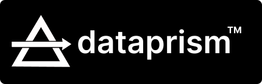

<div align="center">
  
</div>

**Data Prism** is an analytics tool with a reimagined interface that removes the barriers between you and your data. No longer limited by rigid dashboards or predefined queries, DataPrism empowers you to explore, analyse, and extract value from your data in natural language.

## Vision

Imagine a world where data analysis is as intuitive as having a conversation. Where you can ask questions about your data and get immediate, visual answers think graphs charts. Where you can fork someone else's analysis, build upon it, and share your insights with the world.

That's DataPrism: **Cursor for Data Analysis**.

## Inspiration

Being a Founding Engineer was tired of helping PMs setup dashboards, build queries, and create reports. Then go to meetings explaining why a chart is build the way it is, its mostly just me chatting with Claude XD. 

I simply want to build a tool that would allow anyone to explore their data without needing to know SQL and an Engineer again on how to create a chart, and also be able understand others analysis ( think other's GPT Conversations. )

While trying different platform, I found that most are:
- Either too rigid or too complex. 
- Need to be set up by a data engineer or analyst.
- Require you to know SQL or how to create a chart.
- Have a steep learning curve.
- Are not flexible enough to allow you to explore your data in the way you want.
- Are not collaborative enough to allow you to work with your team.
- Are not powerful enough to allow you to build custom visualizations.
- Are not easy to use, wanted to kill myself sometimes.

I wanted to create a tool that was flexible, powerful, and easy to use. First things that comes to mind is **Notion** and **Figma**. I wanted to build a tool that would allow anyone to explore their data without needing to know SQL or how to create a chart.

## Key Features

- **Natural Language Interface**: Ask questions about your data in plain English
- **Universal Data Connector**: Connect to any data source:
  - PostgreSQL and other databases
  - CSV files
  - PDFs
  - Images and videos
  - APIs and more
- **Collaborative Workflows**: Fork, extend, and share analyses
- **Embeddings Engine**: Automatically extract meaning from your data
- **Vector Search**: Find similar data points across different sources
- **Visual Studio**: Build custom visualizations with an intuitive UI
- **Versioning**: Track changes to your data and analyses over time

## Getting Started

```bash
# Clone the repository
git clone https://github.com/OmGuptaIND/shooting-star.git

# Start the server
cd shooting-star/server
make run

# Start the client
cd ../client
bun dev
```

## Technical Architecture

DataPrism consists of:

1. **Frontend**: React/Next.js application with a modern UI
2. **Backend**: Go server with powerful data processing capabilities
3. **Database**: PostgreSQL with pgvector for embeddings storage
4. **Pipeline**: Modular data processing pipelines for different data sources

### Current Progress

- ✅ Basic project structure
- ✅ Vector embedding storage in PostgreSQL
- ✅ CSV file handling and embedding
- ✅ Document schema and block-based representation
- 🚧 Natural language query interface
- 🚧 Visualization components
- 🚧 Data connectors for PostgreSQL and CSVs
- 🚧 PDF and image data extraction
- 🚧 Core Interface Design
- 🚧 Ability to Fork Documents.
- 🚧 Collaborative features

## Contributing

We're building something special, and we'd love your help! Here's how you can contribute:

### Areas We Need Help With

- **Frontend Development**: Building intuitive UI components
- **Data Visualization**: Creating flexible, interactive visualizations
- **NLP Integration**: Improving natural language understanding
- **Data Connectors**: Adding support for more data sources
- **Performance Optimization**: Making data processing faster

### How to Contribute

1. Fork the repository
2. Create a feature branch: `git checkout -b feature-name`
3. Commit your changes: `git commit -m 'Add some feature'`
4. Push to the branch: `git push origin feature-name`
5. Open a Pull Request

See our [Contributing Guide](CONTRIBUTING.md) for more details.

## Funding

DataPrism is currently self-funded. We're committed to keeping the core project open source while developing a sustainable business model.

### Support Us

- **GitHub Sponsors**: [Become a sponsor](https://github.com/sponsors/OmGuptaIND)
- **Open Collective**: [Contribute to our collective](https://opencollective.com/shooting-star)
- **Enterprise Partners**: Contact us about early access and custom integration

## Roadmap

### Q2 2025
- Complete CSV and PostgreSQL integration
- Add PDF and image data extraction
- Implement collaborative features
- Enhance visualization capabilities
- Launch basic natural language query interface
- Release first public beta

### Q3 2025
- Add more data connectors [Datalake, APIs, etc.]
- Enterprise features and integrations
- Implement advanced sharing features
- Advanced security and compliance
- Launch marketplace for analysis templates

## License

This project is licensed under the MIT License - see the [LICENSE](LICENSE) file for details.

## Contact

- **GitHub**: [@OmGuptaIND](https://github.com/OmGuptaIND)
- **Twitter**: [@_its_omg](https://x.com/_its_omg)
- **Email**: omg@billionzeros.com

---

*DataPrism: Illuminating your data journey.*
